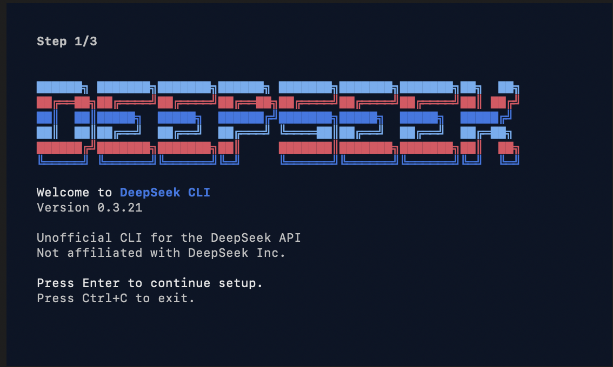

# DeepSeek CLI

An agentic coding harness for [DeepSeek](https://platform.deepseek.com) models, built in Rust.

[](https://github.com/Hmbown/DeepSeek-TUI/actions/workflows/ci.yml)
[](https://crates.io/crates/deepseek-tui)

<p align="center">
  
</p>

Works with DeepSeek v3.2 (chat + reasoner). Ready for v4. Not affiliated with DeepSeek Inc.

## What is this

A terminal-native agent loop that gives DeepSeek the tools it needs to actually write code: file editing, shell execution, web search, git operations, task tracking, and MCP server integration. Coherence-aware memory compaction keeps long sessions on track without blowing up the context window.

Three modes:

- **Plan** — design-first, proposes before acting
- **Agent** — multi-step autonomous tool use
- **YOLO** — full auto-approve, no guardrails

Sub-agent orchestration is in there too (background workers, parallel tool calls). Still shaking out the rough edges.

## Install

```bash
# From crates.io (requires Rust 1.85+)
cargo install deepseek-tui --locked

# Or from source
git clone https://github.com/Hmbown/DeepSeek-TUI.git
cd DeepSeek-TUI && cargo install --path . --locked
```

## Setup

Create `~/.deepseek/config.toml`:

```toml
api_key = "YOUR_DEEPSEEK_API_KEY"
```

Then run:

```bash
deepseek
```

**Tab** switches modes, **F1** opens help, **Esc** cancels a running request.

## Usage

```bash
deepseek                                  # interactive TUI
deepseek -p "explain this in 2 sentences" # one-shot prompt
deepseek --yolo                           # agent mode, all tools auto-approved
deepseek doctor                           # check your setup
```

## Configuration

Everything lives in `~/.deepseek/config.toml`. See [config.example.toml](config.example.toml) for the full set of options.

Environment overrides: `DEEPSEEK_API_KEY`, `DEEPSEEK_BASE_URL`.

## Docs

Detailed docs are in the [docs/](docs/) folder — architecture, modes, MCP integration, runtime API, etc.

## License

MIT
